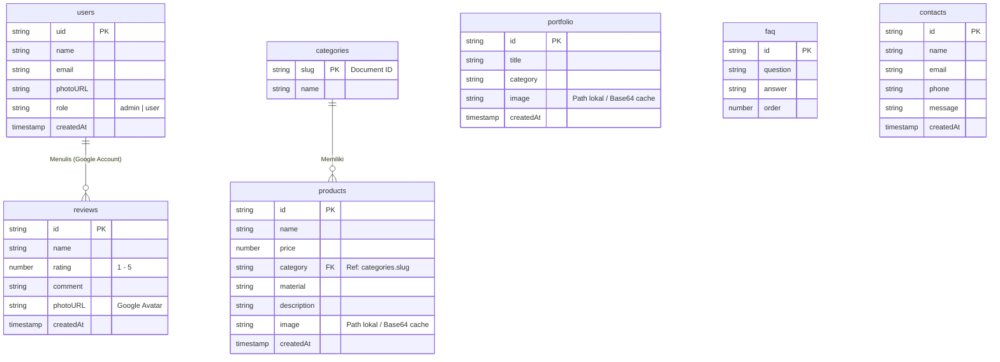

# Aruna Furniture | Premium Scandinavian & Modern Interior SPA

Aruna Furniture adalah aplikasi Single Page Application (SPA) showroom furnitur premium bergaya Scandinavian Minimalist. Aplikasi ini dibangun secara ringan menggunakan teknologi Vanilla web (HTML5, CSS3, JS ES6+) dan memanfaatkan Firebase (Authentication & Cloud Firestore) untuk pengelolaan katalog serta interaksi pelanggan.

---

## 🚀 Cara Menjalankan Proyek Secara Lokal

Karena proyek ini menggunakan **ES Modules** (`type="module"`), browser melarang pemuatan modul secara langsung dari protokol file lokal (`file:///`). Anda **harus** menjalankannya menggunakan web server lokal.

### Langkah 1: Kloning Repositori
```bash
git clone https://github.com/AnomRizqi/aruna-furniture.git
cd aruna-furniture
```

### Langkah 2: Konfigurasi Firebase Kredensial
1. Buat berkas baru bernama **`firebase-config.json`** di folder root proyek Anda.
2. Salin data kredensial dari Firebase Console Anda ke dalam berkas tersebut dengan format berikut:
```json
{
  "apiKey": "ISI_API_KEY_ANDA",
  "authDomain": "ISI_AUTH_DOMAIN_ANDA",
  "projectId": "ISI_PROJECT_ID_ANDA",
  "storageBucket": "ISI_STORAGE_BUCKET_ANDA",
  "messagingSenderId": "ISI_SENDER_ID_ANDA",
  "appId": "ISI_APP_ID_ANDA"
}
```
*(Catatan: Jangan khawatir, berkas `firebase-config.json` sudah didaftarkan di dalam `.gitignore` sehingga tidak akan terunggah ke repositori GitHub publik Anda).*

### Langkah 3: Jalankan Web Server Lokal
Jalankan server lokal menggunakan Node.js (misalnya `http-server` atau extension Live Server di VS Code).

Menggunakan `http-server` (Node.js):
```bash
# Jalankan server langsung via npx
npx http-server -p 8080
```
Setelah server berjalan, buka browser Anda dan akses:
👉 **http://localhost:8080**

---

## 📂 Struktur Folder Proyek

```text
aruna-furniture/
├── .agents/
│   └── AGENTS.md               # Aturan Workspace proyek
├── assets/
│   ├── css/
│   │   ├── admin.css           # Styling Dashboard Admin
│   │   └── style.css           # Styling Landing Page Utama
│   ├── images/                 # Aset Gambar Lokal
│   │   ├── banners/            # Banner Workshop & Hero
│   │   ├── logo/               # Logo Aruna
│   │   ├── portfolio/          # Dokumentasi Proyek Portofolio
│   │   ├── products/           # Katalog Gambar Produk
│   │   └── testimonials/       # Foto Testimonial Pelanggan
│   └── js/
│       ├── app.js              # Logika Utama Web & Operasi CRUD Firebase
│       └── firebase-config.js  # Konfigurasi Koneksi Firebase SDK
├── .gitignore                  # Pengabaian berkas sensitif Git
├── firebase-config.example.json# Template Kredensial Firebase publik
├── firestore.rules             # Aturan Keamanan Database Firestore
├── index.html                  # Berkas SPA Tunggal Utama
└── README.md                   # Panduan Proyek
```

---

## 📊 Skema Database Firestore (ERD NoSQL)

Berikut adalah relasi data antar koleksi di Cloud Firestore yang digambarkan menggunakan diagram Mermaid:



### Penjelasan Hak Akses (firestore.rules)
* **Admins (`role: 'admin'`)**: Memiliki hak penuh untuk melakukan aksi **Read** & **Write** pada seluruh koleksi data.
* **Pelanggan/Public (`role: 'user' / Guest`)**: Hanya memiliki hak **Read** untuk `products`, `categories`, `portfolio`, `reviews`, dan `faq`. Serta hak **Create** untuk koleksi `contacts` (hubungi kami) dan `reviews` (ulasan, wajib login Google).

---

## ☁️ Cara Deploy ke Firebase Hosting (Produksi)

Untuk mempublikasikan proyek Anda secara online dengan gratis, gunakan Firebase CLI:

```bash
# 1. Install Firebase CLI jika belum ada
npm install -g firebase-tools

# 2. Login ke Google Account Firebase Anda
firebase login

# 3. Inisialisasi proyek di folder root
firebase init hosting

# Pilih: "Use an existing project" -> "furnitur-f2bc0"
# Tentukan public directory: "." (folder saat ini)
# Configure as a single-page app: "Yes"
# Set up automatic builds: "No"
# Overwrite index.html: "No" (PENTING!)

# 4. Deploy proyek
firebase deploy
```
Aplikasi Anda akan langsung online menggunakan koneksi HTTPS aman (misal: `https://furnitur-f2bc0.web.app`), sehingga Google Auth akan berjalan otomatis di perangkat mana pun tanpa masalah cookie pihak ketiga.
